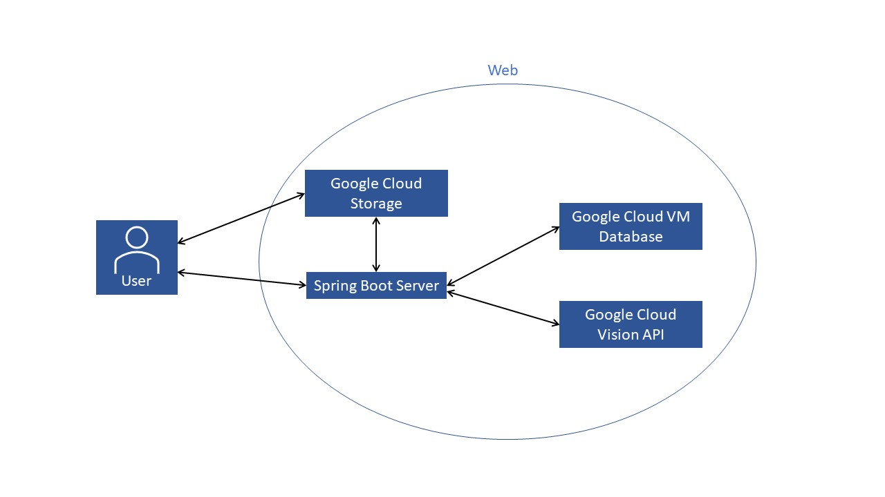
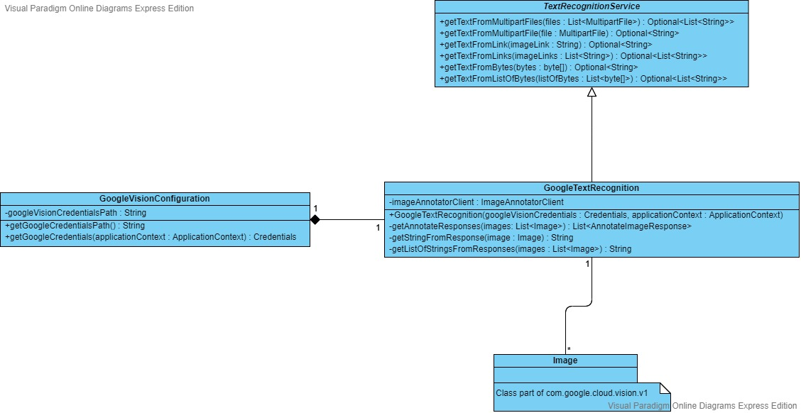
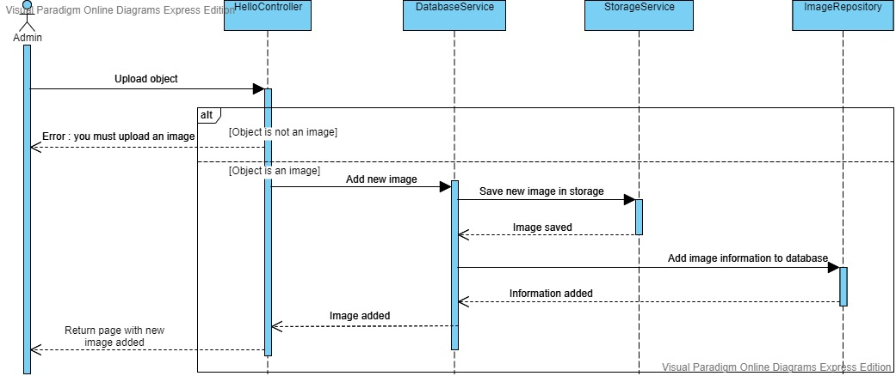

# OO Design & UML

## Architecture

Our product is a client server application, dependent on multiple external systems, including a database, 
a cloud storage and an API for text extraction from images. The *Spring Boot Server* was containerized using Docker 
so that it can run on any server.

For the database, we chose to use MariaDB since it is a free alternative to the MySQL database. This MariaDB instance 
runs on a virtual machine, using the Google Cloud Compute Engine. Thanks to Spring Boot, it does not matter where 
the database is located, the application can access it from anywhere. We use a Google Bucket for the cloud storage. 
All the images are stored inside this bucket, and the users are given public links to those images. Those public links 
only allow them to see the images. This way, when a user opens the gallery, the images will be downloaded on the client
side, rather than the server side. 
 
Finally, for the text extract part, we use Google Cloud Vision API. An image is uploaded by the client, then the server 
sends it to the Vision API and returns the text extracted from it.  

## Static UML

This diagram was created in the context of better designing the class hierarchy of the text recognition service of the 
program. Since abstraction is essential for building a large-scale program, the class *TextRecognitionService* is an 
interface describing what the service should do, meanwhile *GoogleTextRecogniton* is just an implementation of this class. 

After doing some comparisons and talking with our client, we decided to use Google Cloud Vision API instead of the 
Amazon equivalent. By having an interface, it will be easy to use another API in the future if the client decides so. 
In fact, Spring Boot facilitates the use of different configurations, making it possible to have multiple 
implementations of an interface and changing the one that is used from the properties file. 

The class *GoogleVisionConfiguration* is the one that provides the credentials for the Vision API, without this class 
being instantiated, the *GoogleTextRecognition* class will not be instantiated either. The decision to make
implementations of the interface dependent of a configuration class makes it easy to switch between different 
configurations.

By designing the model for the text recognition service, we were able to gain experience in creating an abstract 
service, whose implementation is hidden from the one using it, so no assumptions about it should be made.

## Dynamic UML

This diagram was created in the context of modeling the interactions between the services when an admin uploads an 
image. While the process itself might seem simple, it involves communication between a lot of different services. 
The *DatabaseService* takes in the image and the information provided by the admin and saves the image in the storage
and the information in the database. 

It is worth noting that *StorageService* is an interface with multiple implementations. Since our client decided it 
would be better to have everything in one place, we moved the cloud storage from Amazon S3, where it originally was, 
to Google Storage. This transition was easy to make since we only had to make another implementation of the 
*StorageService* interface. We decided to leave both implementations in case our client changes his mind in the future. 
The implementation being used can be changed from the properties file. Each implementation has a configuration that 
provides the necessary credentials and settings. Only one configuration will be instantiated, based on the settings in 
the property file.

From modeling this part of the system, we learned that the client might change his mind about the specifications of 
the product, and that we, as developers, need to work with this uncertainty. Changing parts of our application becomes 
an easy task if abstraction is being used from the very beginning. 

