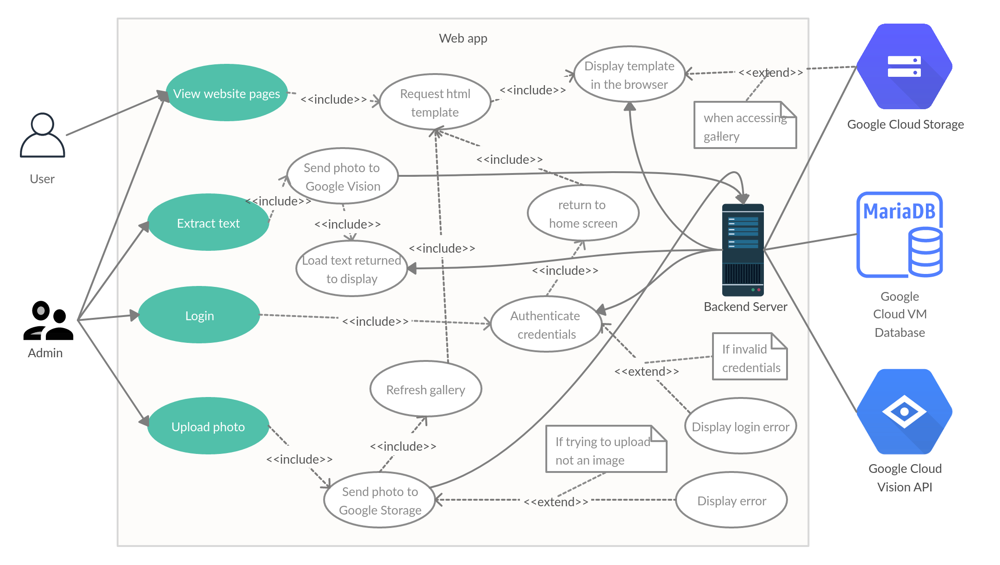

# Requirements

### Stakeholders:

###### Mark Pajak

Mark is the head of Digital Development at the Bristol Museum and our client for this project.
He is responsible for digitalisation process of museum's archives and improving user experience.
He will also take our final product to deploy it and synchronize with other museum's web systems.  

######  Bristol Museum

Bristol Museum is the client's company. This institution possesses large amounts of important
historical data, which it wants to make more available and useful. It has its own 
currently operating website and servers.

###### Environmental scientist

Scientists, especially those studying the environment, that are looking for more data that 
would help them in understanding climate changes occurring globally nowadays.

###### Basic user

Basic user is any person of any age interested in history. Such person visits the 
website from curiosity and wants an easy way of accessing the museum's archives. 

### Stories:

1. As the project director, I want to get a working product so that I can get a valuable text from images of our documents.
2. As the director’s company, we want your product to be useful and easy to use so that other employees would be able to efficiently use it.
3. As an environmental scientist, I want to gain digital data from the museum, so that I have more sources to analyse the effects of climate change.
4. As a basic user, I want to be able to view some of the museum's handwritten documents digitally

### Use-case Diagram

### Requirements Solutions 
##### Requirement 1 Solution | Viewing website
1. The user accesses the address of the website.
1. The home page is presented to the user.
1. From the left side menu the user presses Gallery.
1. The user is presented with the gallery page and the images in gallery start loading.
1. After all the images have loaded, the user can press on any image to focus only on it and show additional information about it.
1. Upon pressing the X button on the right side, all the images are visible again.

###### Alternative flow
3.a The user presses Text Extract instead.

3.b The user is prompted with the Login page.

###### Exceptional Flow
1.a The user accesses the address through http rather then https.

1.b The page refuses to load. User case ends.

1.a The user does not have internet. User case ends.

##### Requirement 2 Solution | Login
1. The user accesses the website 
1. From the left side menu, the user presses on Login
1. The user is prompted with the log in page
1. The user types in the username and the password and presses Sign In
1. The user is prompted with the home page

###### Alternative flow
4.a The user types in a wrong combination of username and password

4.b The user is prompted again with the log in page and an error message

###### Exceptional Flow

4.a The user does not have an account. User case ends.

##### Requirement 3 Solution | Upload an image
1. The user accesses the website and logs in.
1. The user presses on Gallery.
1. The user presses on the Choose File button at the top of the page and chooses an image.
1. The user completes the text fields below the Choose File button with additional information about the image.
1. The user presses on the Upload Image button.
1. The page is refreshed an the new image is going to appear in the gallery.

###### Alternative flow

1.a The user does not log in.

1.b When the user presses on Gallery, there will be no Choose File button.

###### Exceptional Flow

3.a The user chooses a file that is not an image.

3.b When the user presses on the Upload Image button, the user will be prompted with an error page.

